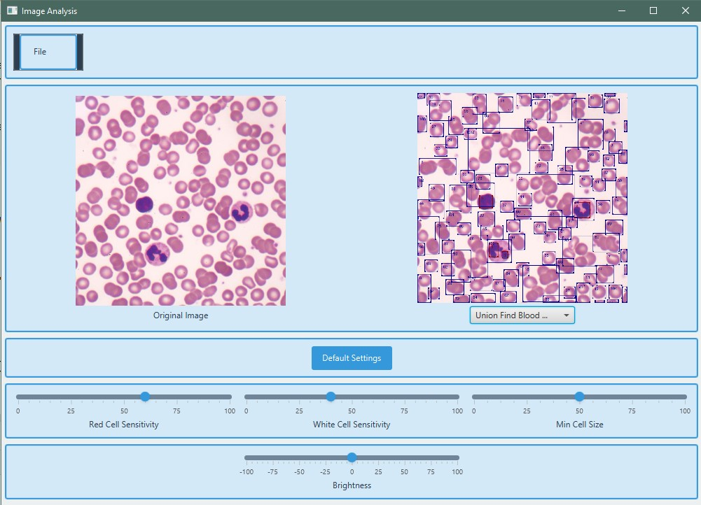
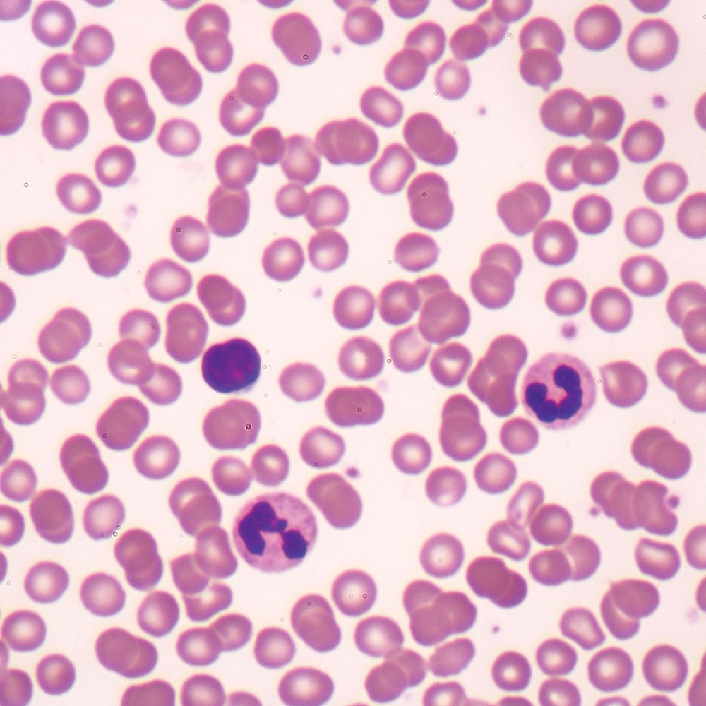
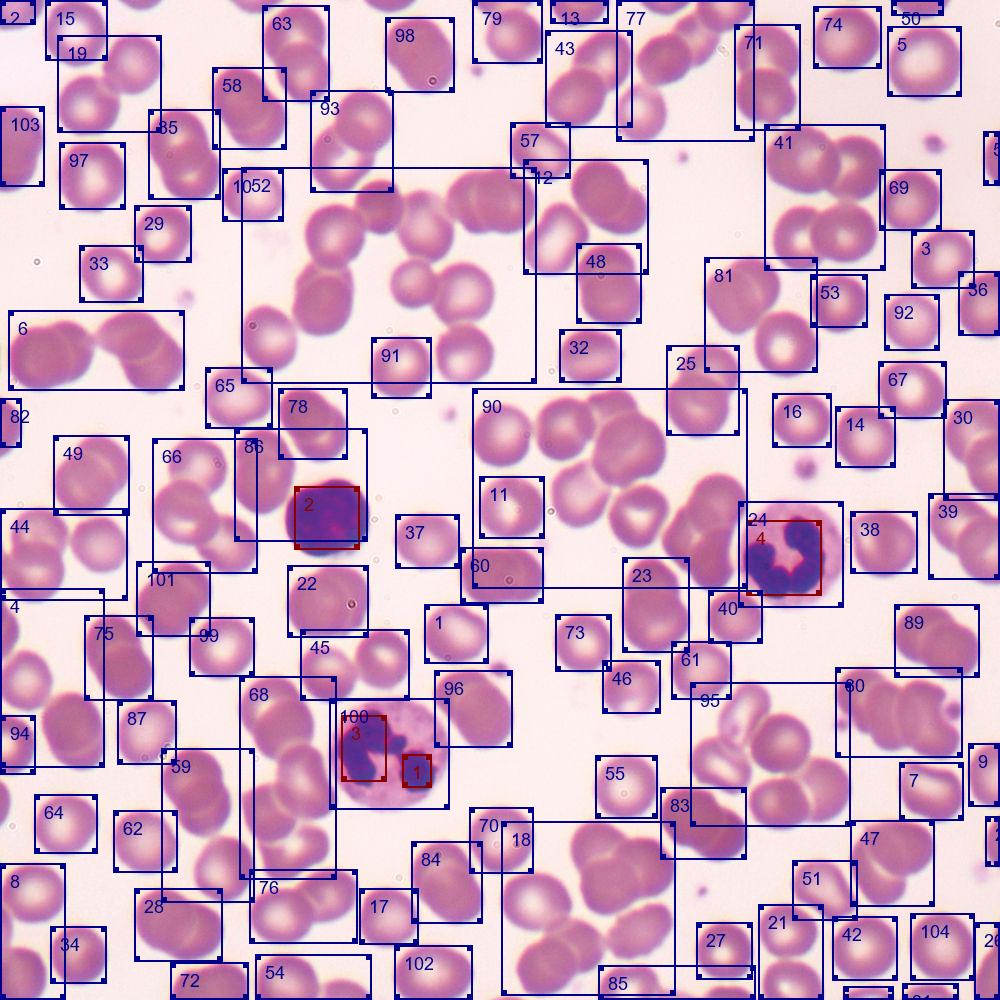
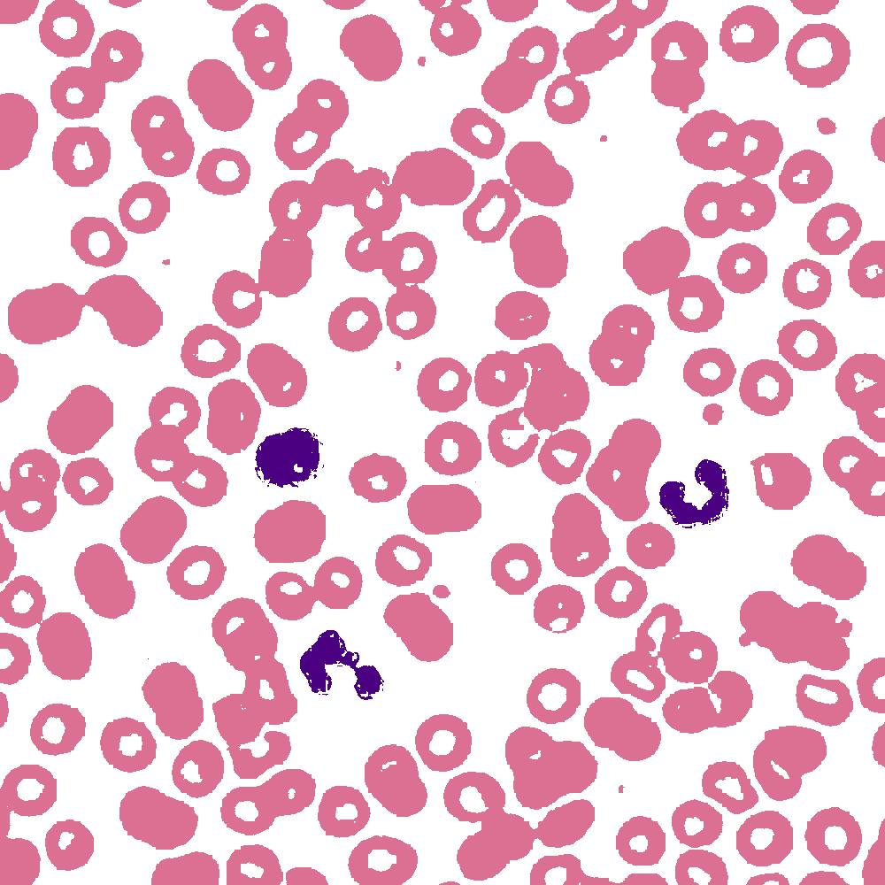

# Blood Cell Image Analysis

An application for analyzing microscope images to detect and count blood cells using computer vision techniques.

## Overview

This JavaFX application processes microscope images of blood samples to identify and count individual blood cells. It uses image processing techniques including thresholding, connected component analysis, and size-based filtering.

## How It Works

The analysis process follows these steps:

1. **Image Pre-processing**
   - Converts the image to grayscale
   - Applies brightness adjustments
   - Uses thresholding to separate cells from background
   
    

2. **Cell Detection**
   - Implements Union-Find algorithm to identify connected components
   - Filters components based on size parameters to identify individual cells
   - Marks detected cells on the image

    

3. **Tricolour Analysis**
   - Classifies detected cells based on size characteristics
   - Uses color coding to visualize different cell categories:
      - Pink: Red Blood Cells
      - Purple: White Blood Cell Nuclei
   - Eliminates cell border detection errors by turning the background white.

    

## Sample Images
### Original (stained) Slide Image
<figure>
  
  <figcaption>Original microscope image showing blood cells</figcaption>
</figure>

  

### Processed Image with Cells defined and counted
<figure>
  
  <figcaption>Processed image with detected blood cells highlighted</figcaption>
</figure>

  

### Tricolour Process
<figure>
  
  <figcaption>Tricolour visualization showing cell classification</figcaption>
</figure>

  

## Features

- Real-time parameter adjustment
- Visual feedback of detection results
- Size-based filtering to distinguish cells
- Cell count statistics

## Technical Details

- Built with JavaFX and OpenCV
- Uses Union-Find algorithm for connected component labeling
- Implements custom image processing filters
